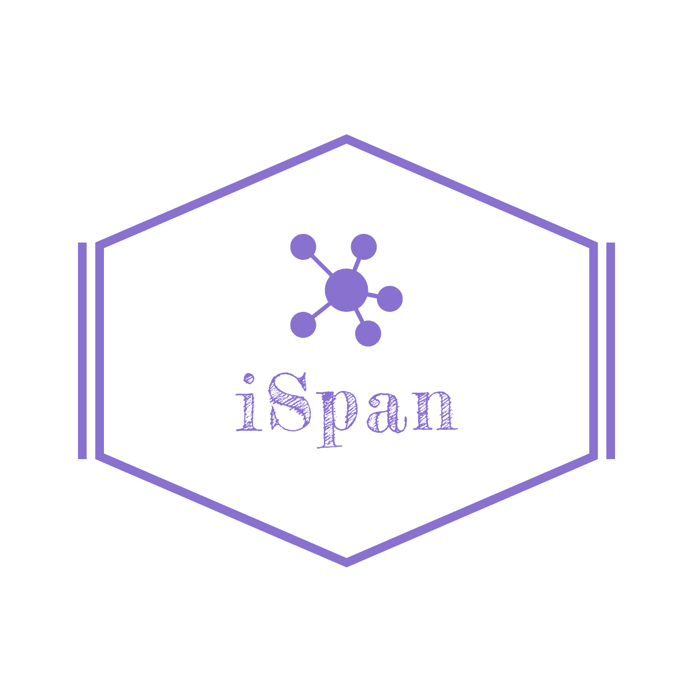
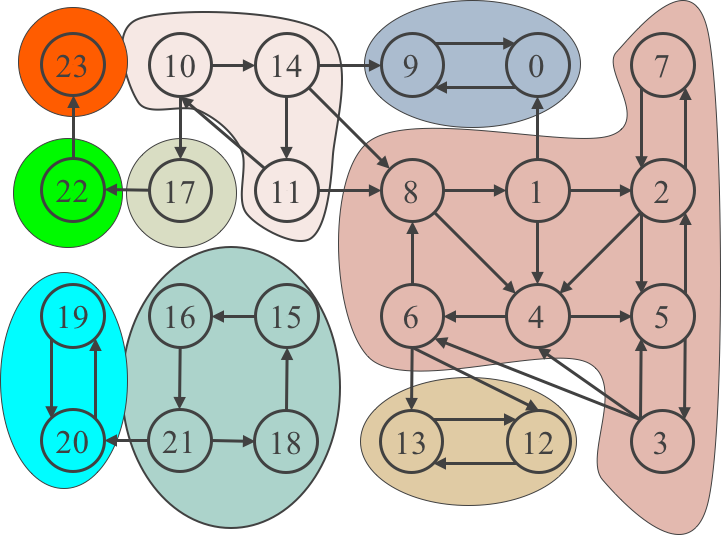

# iSpan: Parallel Identification of Strongly Connected Components with Spanning Trees

## Introduction
###1. What is strongly connected component?
Detecting strongly connected components (SCCs) in a directed graph is crucial for understanding the structure of graphs. Most real-world graphs have one large SCC that contains the majority of the vertices, as well as many small SCCs whose sizes are reversely proportional to the frequency of their occurrences. For both types of SCCs, current approaches that rely on depth or breadth first search (DFS and BFS) face the challenges of both strict synchronization requirement and high computation cost. 



###2. What is iSpan?
Motivated, we advocate a new paradigm of identifying SCCs with simple spanning trees, since SCC detection requires only the knowledge of connectivity among the vertices. We have developed a prototype called iSpan, which consists of parallel, relaxed synchronization construction of spanning trees for detecting the large and small SCCs, combined with fast trims for small SCCs. We further scale iSpan to distributed memory system by applying different distribution strategies to the data and task parallel jobs. The evaluations show that iSpan is able to significantly outperform current state-of-the-art DFS and BFS-based methods by average 18x and 4x, respectively.


## Tutorial
You can find the source code in "src/", some useful scripts in "script/", and some test result under "result/"

More tutorials will be released soon.

## Prerequisites
The following softwares are required, but the versions do not have to be the same. The versions listed are used in our experiments.

```javascript
GCC-4.8.5
OpenMP-3.1
Makefile
```

## Installing
Get into the "src/" directory, then compile the source code with Makefile,

```python
cd src/
make
```

If the prerequisites are correct, the make process should be good. You will get the executable file "ispan". Run "ispan" to see the parameters and use the correct ones. For simplicity, you can change the "bash_one.sh" file and run it.

```python
./bash_one.sh
```

## Graph format

We are using compressed sparse row (CSR) format stored in binaries. We provide a converter from regular text edge list to our CSR binary format. One can find the converter under "graph_converter/".  

## Authors
Yuede Ji, email: yuedeji@gwu.edu

Hang Liu, email: hang_liu@uml.edu

H. Howie Huang, email: howie@gwu.edu

## Reference
If you use iSpan in your project, please cite the following paper.

```python
@inproceedings{ji2018s,
    title={iSpan: parallel identification of strongly connected components with spanning trees},
    author={Ji, Yuede and Liu, Hang and Huang, H Howie},
    booktitle={Proceedings of the International Conference for High Performance Computing, Networking, Storage, and Analysis},
    pages={58},
    year={2018},
    organization={IEEE Press}
}
```

<!--- ## TODO
More related codes and files will be released soon.
* User guide
* Graph converter
* ...
-->
